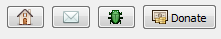
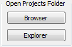
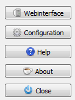
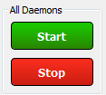

==== Using the Server Control Panel

This section describes the usage of the Server Control Panel.

images::../images/Server-Control-Panel-MainWindow.png[Server Control Panel - MainWindow]

If the Server Control Panel is new for you please check the <<#_running,Running>> first before you continue reading.

When we look at the Server Control Panel more closely, you will see that it consists out of 6 parts:

images::../images/Server-Control-Panel-MainWindow-HighlightedParts.png[Server Control Panel - MainWindow with Highlighted Parts]

===== Part 1 - Project Buttons

1. Use this to visit the Home page of WPN-XM.org.
2. Go to the WPN-XM mailing list.
3. Report issue or request feature.
4. Support the development of WPN-XM by donating.

===== Part 2 - Server Controls and Monitoring

image::../images/Server-Control-Panel-p2.png[Server Control Panel - Part 2]

Start and stop the different daemons. Access the logs and error log files. Review and change configuration settings.

===== Part 3 - Tools

image::../images/Server-Control-Panel-p3.png[Server Control Panel - Part 3]

1. Show PHP information.
2. Manage your databases using phpMyAdmin.
3. Profiling in the browser using webgrind.
4. Use adminder for administration different database systems like MySQL, MongoDB, SQLite, PostgreSQL, ...

===== Part 4 - Open Projects Folder

Browse through your projects or open the explorer to work on your files.

===== Part 5 - Right Side Menu

1. Open Webinterface in Browser
2. Open the Configuration Panel
3. View Wiki help page.
4. About window
5. Close the Panel (stays running in the background)

===== Part 6 - Start and Stop Buttons

Start or Stop All Daemons
