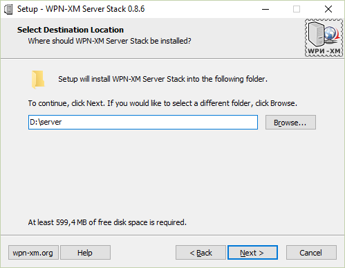
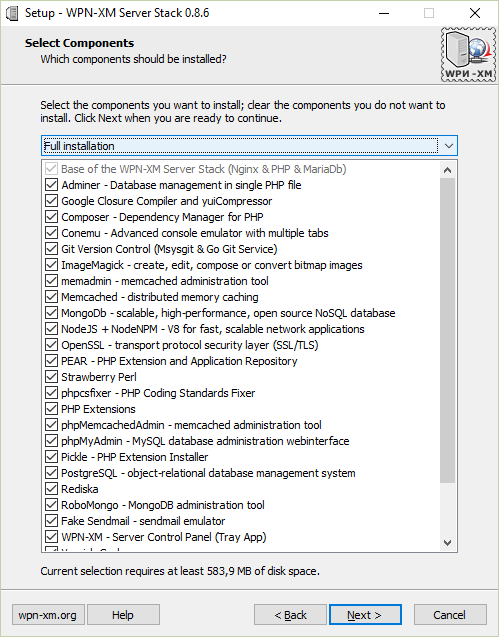
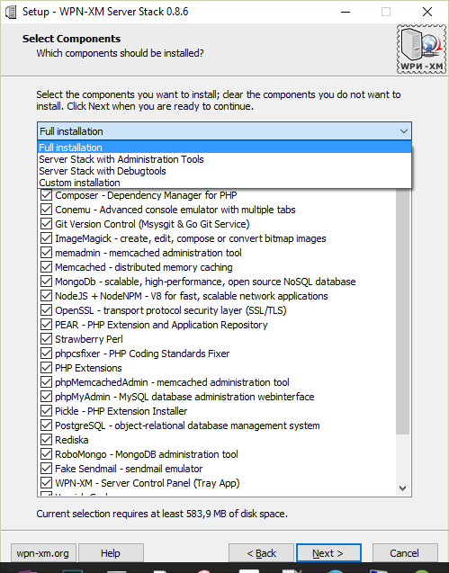
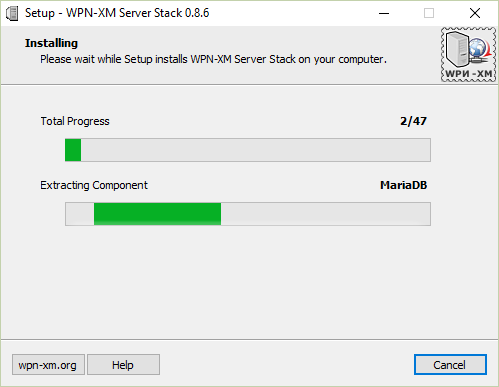
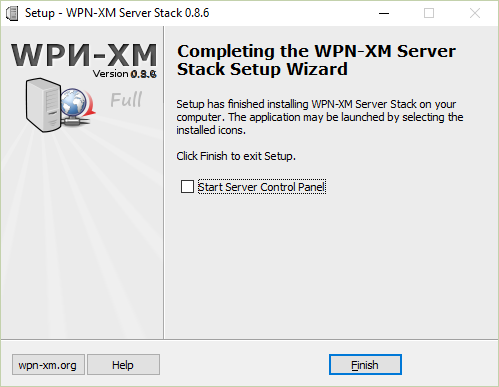
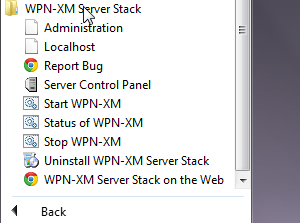
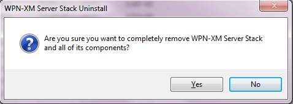
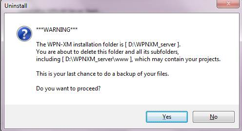

=== Installation

This chapter explains how to install WPN-XM Server Stack for Windows.

The installation wizard packages for WPN-XM are available starting with version v0.1.0.
The packages are available for the x86 (32 bit) and since v0.8.1 also for the x86_64 (64 bit) processor architecture.
You can choose between two installer types: we provide packaged installers and web-installers. 
We package installers for http://php.net/supported-versions.php[every supported PHP version].

The following installer packages are available:

* Lite & Lite-RC Installer
* Standard Installer
* Full Installer
* Web-installer

The Standard and Full Installers contain a large set of components in one big setup executable.
The Lite installer ships a minimal set of components to get you started. This version ships a stable PHP version.
The Lite-RC installer is the Lite packages, but ships the latest PHP RC (Release Candiate) version for testing purposes.

The Web-installer is a small file you can use to select and download the components of your choice
from the web. Pros: Instead of downloading one large installer containg all components, you are downloading 
the small web-installer and then only the components you select. This has the advantage of saving 
you time and bandwidth. You can also download and save the web-installer for later installation.
Cons: The web-installer is a problem, when packages must go through a review process before installation. 
External links are often discouraged in this review process, because they require external calls during install 
and can make restoration of service difficult, when the links or the link targets change.

Important: If you face problems downloading certain components using the web-installer, please
disable your Anti-Virus and re-try.

You might install WPN-XM either by using the common user interface or by installing it in silent mode.
The silent mode is for integration with automatic and unmaintained installation procedures.

The following sections explain the installation wizard user interface.
We'll use screen-shots from an w64 installation on Windows 10 below.

==== Installation UI

Using the installation wizards user interface is the typical mode of installation.

To start the installer, just click on the setup executable, e.g. "WPNXM-0.8.6-Full-Setup-php56-w64.exe".

=====  Welcome

image::../images/wpnxm-install-screen1.png[WPN-XM Screenshot 1]

////
=====  License Agreement

/*image::../images/wpnxm-install-screen2.png[WPN-XM Screenshot 2]*/

Click on "I accept the terms".
////

=====  Choose target folder

=====  Custom Setup / Components Selection

On the Custom Setup Screen you might choose what software components and features to install.

The drop-down box will show you four default software component pre-selections you might choose from.

The Lite installation wizard has only two pre-selection setups: Full and Custom.
While all other installation wizards have four default preallocation setups:

. *Full Installation*
    * This preselects everything for installation.
. *Server Stack with Administration Tools*
    * Base (NGINX, MariaDB, PHP)
    * Admin Tools (Tray App, Webinterface)
    * Dependency Tool (composer)
. *Server Stack with Debug Tools*
    * Base (NGINX, MariaDB, PHP)
    * Admin Tools (Tray App, Webinterface)
    * Debug Tools (xhProf, XDebug, webgrind)
    * Dependency Tool (composer)
. *Custom Installation*
    * This deselects everything and you might choose freely.

=====  Select the Startmenu Folder

image::../images/wpnxm-install-screen4.jpg[WPN-XM Screenshot 4]

You might select a folder or sub-folder of the start menu,
where the WPN-XM start menu entries will then be created.

=====  Select Additional Tasks

image::../images/wpnxm-install-screen5.png[WPN-XM Screenshot 5]

You might select various tasks to perform during installation,
like creation of shortcuts in the start menu and on your desktop.
If you install the files on a portable device, don't forget to enable "Portable Mode".

=====  Installation Running Screen

The screen shows the progress while downloading and installing the components for your WPN-XM stack.

=====  End

Installation is finished now.

==== Start Menu Entries

After the installation finished, you will find the following new start menu entries:

**Description of menu entries and what they do**

* Administration - Opens the Administration Webinterface of WPN-XM in your default Browser.
* Report Issue - Opens the Issues Reporting Page of WPN-XM
* Server-Control-Panel - Starts the Tray Application
* Start - Starts all daemons and opens the webinterface your browser.
* Status - Shows the status of all daemons in an endless loop.
* Stop - Stops all daemons.
* WPN-XM Server Stack in the Internet - Opens the official WPN-XM website.

==== Uninstallation

Simply execute the uninstaller program (unins???.exe) in the installation folder.

You'll also find a shortcut in the start menu entries of WPN-XM.

==== Installation logs

If you encounter a bug in the installer, you might read the installer logs for diagnosis.
You'll find the logs in the installation folder, e.g. c:\wpnxm-server.
The name of the log file is "Setup Log yyyy-mm-dd #num.txt", e.g. "Setup Log 2012-05-12 #005.txt".
It's a text file and you might open it with notepad or with the editor of your choice.
Please attach the logs when creating bug reports.

==== Silent Installation & Unattended Installation

In our experience, the `/silent` switch is usually sufficient for a basic unattended installation.
But to be completely sure, we recommend `/sp- /silent /norestart` as startup parameters.

There is also the parameter `/verysilent`. If you use `/verysilent`, my advise is to use the
parameter `/norestart` as well, just to be sure that the machine will not reboot without prompting
after or during the installation procedure.

You might also specify the target directory for the installation by using the parameter `/dir`, e.g. `/dir="x:\dirname"`.

Using the pieces of information provided above, then a complete silent installation CLI call would look like this:
`*setup.exe /VERYSILENT /SP- /DIR="C:\INSTALL_DIR" /NORESTART`.

The switches for Inno Setup Silent Installation are fully documented in the ISetup.hlp file in the Inno distribution.

See http://unattended.sourceforge.net/InnoSetup_Switches_ExitCodes.html[InnoSetup Switches and ExitCodes].

==== Silent Uninstallation

The uninstaller program (`unins???.exe`) accepts optional command line parameters.
You might use the parameters `/verysilent` and `/norestart`.
