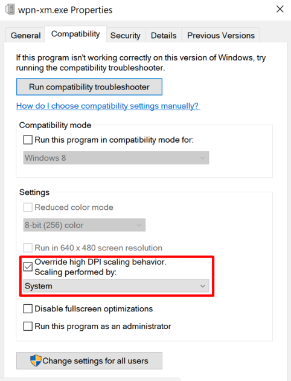

=== Enabling High-DPI Support

When you are using a high dpi display, the icons, buttons and text of the SCP might be tiny.
While we are still trying to solve this issue, here is a workaround.

Steps:
1. Right-click wpn-xm.exe
2. Click on "Properties"
3. Go to tab "Compatibility"
4. Enable the checkbox for "Override High-DPI Scaling behaviour.", so that scaling is performed by the system

